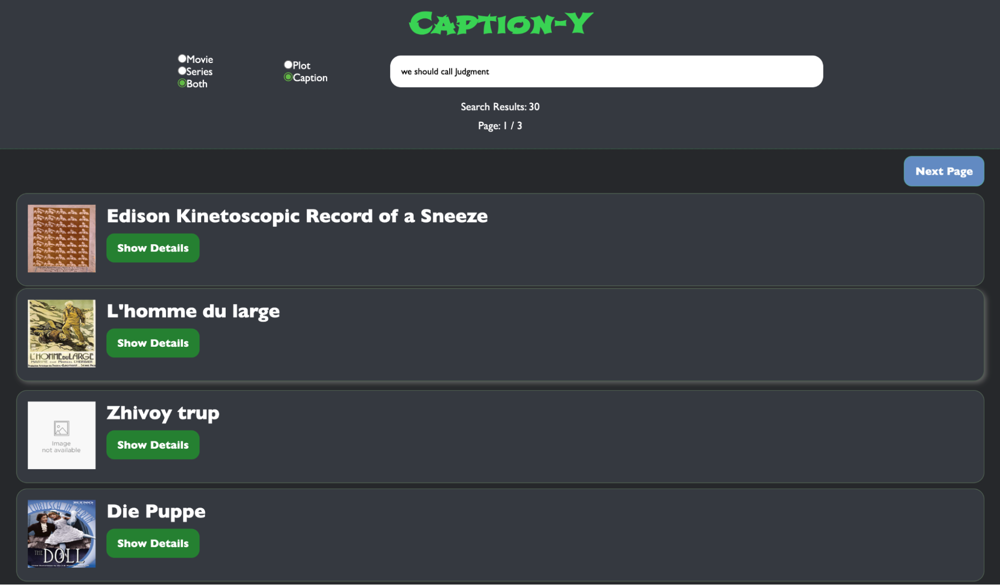
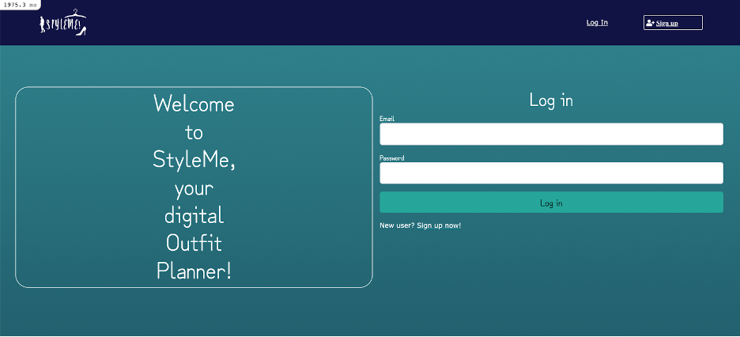
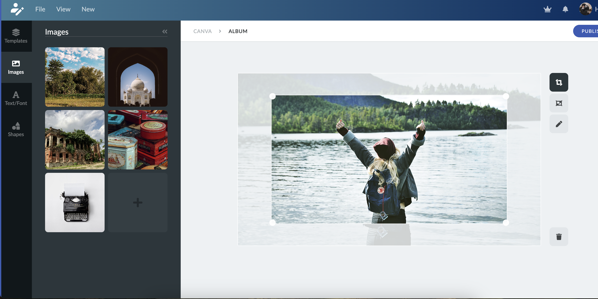

# S Khadija Tirmazi's Portfolio

Welcome to my portfolio! This repository showcases my skills and projects as a full-stack developer. Below, you'll find information on how to navigate through my work, the technologies I've used, and how to get in touch with me.

## Table of Contents

- [Introduction](#introduction)
- [Projects](#projects)
- [Technologies](#technologies)
- [APIs and Frameworks](#apis-and-frameworks)
- [Installation](#installation)
- [Usage](#usage)
- [Contact](#contact)

## Introduction

Hello! I'm S Khadija Tirmazi, a dedicated full-stack developer with a passion for creating accessible and robust web applications. This portfolio highlights some of my favorite projects and the technologies I've worked with. 

## Projects

### 1. [Caption-Y](#)
A search engine for finding movies and TV shows. Users can enter queries and get results. Queries can be lines from movies or things that have been said in the movie (not necessarily quotes) or descriptions of the plot.
- **Technologies**: Flask, Python, PostgreSQL, React, ElasticSearch
- **Key Features**:
  - Movie and TV show search engine
  - Supports queries for lines and plot descriptions
- **Screenshot**: 

### 2. [styleMe](#)
StyleMe is a full-stack web application built using Ruby on Rails, designed to provide users with a dynamic platform for exploring and experimenting with different clothing styles and fashion combinations.
- **Technologies**: Ruby on Rails, PostgreSQL, Bootstrap, Amazon S3, HTML, CSS, JavaScript, AJAX, JQuery
- **Key Features**:
  - User profile customization
  - Fashion combination exploration
- **Screenshot**: 

### 3. [Canva Clone](#)
A front-end prototype of a Canva clone application created using HTML, CSS, and JavaScript. This project showcases a visually appealing and intuitive user interface for users to design various graphics.
- **Technologies**: HTML, CSS, JavaScript
- **Key Features**:
  - User-friendly design workspace
  - Various graphic design tools
- **Screenshot**: 

### 4. [Unixish](#)
Implemented a Unix shell using Java multi-threading to support background processes, file system, redirection, and text operation commands. Enabled use of basic commands e.g., cd, pwd, ls, >, grep, etc. and concurrent execution of piped commands with &
- **Technologies**: Java, Multithreading, Concurrency
- **Key Features**:
  - Support for background processes
  - Basic Unix commands
  - Concurrent execution of commands
- **Screenshot**: 

## Technologies

Here are some of the technologies and tools I have experience with:

- **Frontend**: HTML, CSS, JavaScript, TypeScript, React, Next.js
- **Backend**: Node.js, Ruby on Rails, Flask
- **Database**: PostgreSQL, MongoDB, MySQL
- **Others**: Git, Docker, Firebase, Tailwind CSS, Bootstrap

## APIs and Frameworks

- **ElasticSearch**: Used for the search functionality in Caption-Y.
- **Amazon S3**: Used for storage in styleMe.
- **AJAX & JQuery**: Used for dynamic content loading in styleMe.
- **Prisma**: Used for database management.
- **GraphQL**: Used for efficient data querying.

## Installation

To run the projects locally, follow these steps:

1. Clone the repository:
   ```bash
   git clone https://github.com/t03t/portkt.git
2. Navigate to the project directory:
    ```bash
    cd portkt
3. Install dependencies:
    ```bash
    npm install
4. Run the development server:
    ```bash
    npm run dev

## Usage
Each project has its own directory within this repository. Navigate to the respective project directory and follow the instructions in the README file of each project to get it running.

## Contact
Feel free to reach out to me for any questions or collaboration opportunities:

- **Email** : itstirm@gmail.com
- **LinkedIn** : www.linkedin.com/in/stirmazi

Thank you for visiting my portfolio! I look forward to connecting with you.